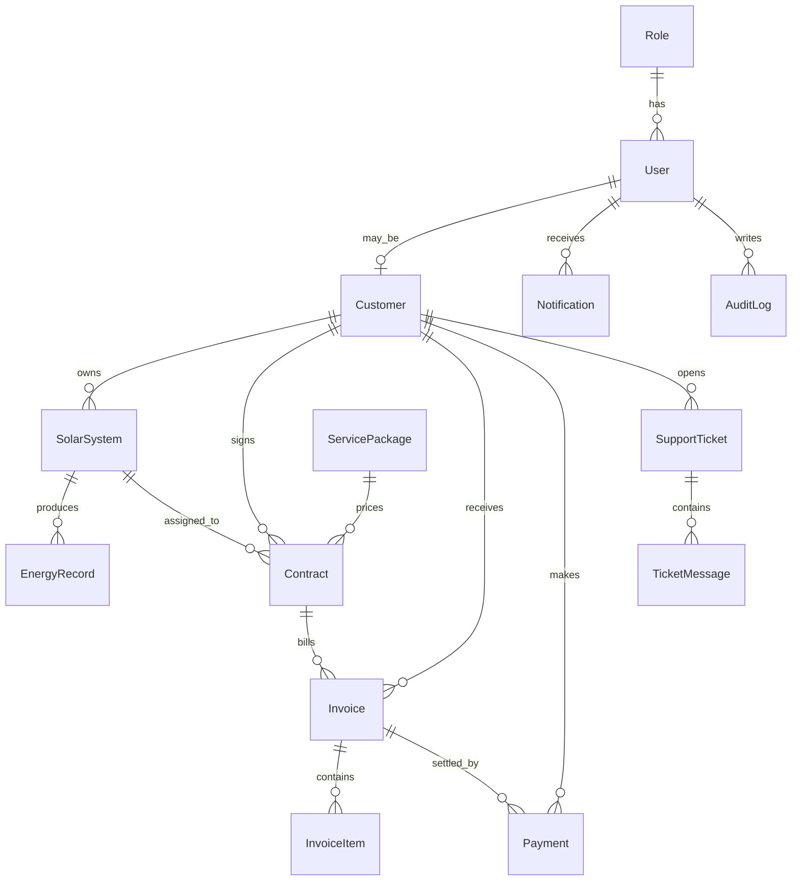

# Moka Solar Platform

Deploy nhanh lên VPS Ubuntu: xem [DEPLOY_VPS_UBUNTU.md](/D:/thietkeweb/webmokasolar/moka-solar-platform/DEPLOY_VPS_UBUNTU.md)

Production-ready MVP for a Tesla-inspired solar energy SaaS tailored to Vietnam. The project combines:

- A premium public website for sales and investor demos
- A customer portal for production, savings, invoices, online payment and support
- An admin operations cockpit for customers, systems, contracts, billing, reports and service packages
- A NestJS + Prisma backend with JWT auth, refresh token flow, RBAC and audit logs

## 1. Overall Architecture

### Product layers

- `frontend/`: Next.js 15 app with responsive public marketing pages and protected customer/admin portals
- `backend/`: NestJS modular API for auth, users, customers, solar systems, contracts, energy records, invoices, payments, support tickets, notifications and reports
- `database/`: PostgreSQL 16 with Prisma ORM and seeded demo portfolio
- `deployment`: Dockerfiles per app plus root `docker-compose.yml`

### Runtime design

- Frontend consumes REST APIs exposed by NestJS under `/api`
- Backend persists contract, billing and operations data in PostgreSQL
- Prisma seed creates a realistic demo portfolio with multiple contract models
- JWT access token + refresh token support secure session flow
- RBAC enforces `SUPER_ADMIN`, `ADMIN`, `CUSTOMER`
- Audit logs capture sensitive admin actions

### Expansion path

- Real inverter APIs: Growatt, Solis, Deye, Huawei
- AI forecasting for generation and demand
- SMS, email, Zalo payment reminders
- Flutter / React Native mobile clients
- Multi-tenant branch or agency mode

### Customer portal PWA

- Customer portal now supports Progressive Web App installation via `manifest.webmanifest`, app icons and a service worker.
- App shell behavior is optimized around `/customer`, `/customer/billing`, `/customer/payments` and `/customer/systems`.
- Mobile UX improvements include:
  - install prompt card for Android and iPhone guidance
  - bottom navigation on mobile
  - app-like loading state for the customer portal
  - cached static assets for faster repeat visits
- Service worker readiness now includes placeholder `push` / `notificationclick` handlers so payment reminders, data updates and system alerts can be connected later without refactoring the shell again.
- Local build and test:
  - `cd frontend`
  - `npm run build`
  - open `http://localhost:8080/customer` on a phone or via the same network / tunnel
  - Android Chrome: use `Add to Home screen`
  - iPhone Safari: use `Share -> Add to Home Screen`
- To upgrade this customer portal to a native app later:
  - reuse the existing REST API and auth flow
  - reuse the customer navigation model in [frontend/src/lib/customer-app.ts](/D:/thietkeweb/webmokasolar/moka-solar-platform/frontend/src/lib/customer-app.ts)
  - migrate push topics from the current service worker into Expo / React Native notifications
  - keep UI modules such as overview, billing, payments and systems as separate screens

### ChatGPT in admin

- Admin and super admin can use ChatGPT directly inside the operations portal at `/admin/ai`
- The feature uses the official OpenAI JavaScript SDK on the backend and keeps the API key off the frontend
- Required env vars:
  - `OPENAI_API_KEY`
  - `OPENAI_MODEL` (default: `gpt-5.4-mini`)
  - `AI_SETTINGS_SECRET` (optional but recommended when saving API keys from the admin UI)
- Backend endpoints:
  - `GET /api/ai/status`
  - `GET /api/ai/settings`
  - `PATCH /api/ai/settings`
  - `POST /api/ai/chat`
- Current guardrails:
  - Admin-only access
  - Requests are logged to audit logs
  - Responses are not stored upstream by default (`store: false`)
  - API key can be configured directly in the admin workspace at `/admin/ai`

### Public website chat and conversion flow

- Public branding, menu, footer, contact links, CTA links and pricing detail content are centralized in [frontend/src/config/public-site.ts](/D:/thietkeweb/webmokasolar/moka-solar-platform/frontend/src/config/public-site.ts)
- The floating website chat is available across the public site and supports:
  - direct contact capture
  - guarded AI Q&A for pricing, implementation flow and FAQ
- Public AI chat runs only through the backend:
  - `POST /api/ai/public-chat`
- Guardrails for website AI chat:
  - IP + visitor based message limits
  - cooldown when users send messages too quickly
  - message length and history limits
  - human-check confirmation before sending
  - scope-limited prompt focused on Moka Solar, rooftop solar, pricing and support basics
  - fallback to direct lead capture when AI is unavailable or detailed consultation is needed
- Relevant env vars:
  - `OPENAI_WEBSITE_MODEL`
  - `WEBSITE_AI_CHAT_ENABLED`

### SEMS inverter integration

- Configure `SEMS_LOGIN_URL`, `SEMS_ACCOUNT`, `SEMS_PASSWORD` in [.env.example](/D:/thietkeweb/webmokasolar/moka-solar-platform/.env.example)
- Preview live inverter data with `POST /api/energy-records/sems-preview`
- Sync a power station into a specific solar system with `POST /api/energy-records/sems-sync/:systemId`
- The latest SEMS snapshot is stored on each `SolarSystem` and exposed in the customer dashboard

### Deye OpenAPI monthly PV billing integration

- Admin manages Deye OpenAPI connections at `/admin/deye`
- Backend routes:
  - `GET /api/deye-connections`
  - `GET /api/deye-connections/:id`
  - `GET /api/deye-connections/:id/logs`
  - `POST /api/deye-connections`
  - `PATCH /api/deye-connections/:id`
  - `DELETE /api/deye-connections/:id`
  - `POST /api/deye-connections/:id/test`
  - `POST /api/deye-connections/:id/sync-stations`
  - `POST /api/deye-connections/:id/sync-monthly-history`
  - `POST /api/deye-connections/:id/sync`
- Token flow:
  - backend hashes the Deye password with SHA256 lowercase
  - calls `POST /v1.0/account/token?appId=...`
  - stores `accessToken`, `refreshToken`, `tokenType`, `expiresIn`, `tokenExpiredAt`
  - automatically refreshes the token when it is close to expiring
- Sync flow:
  - `POST /v1.0/account/info` validates the account and stores `companyName` + `roleName`
  - `POST /v1.0/station/listWithDevice` upserts `SolarSystem` + `Device`
  - `POST /v1.0/station/history` with `granularity=3` upserts `MonthlyEnergyRecord`
  - if customer mapping and unit price are available, billing is pushed into `MonthlyPvBilling`
- Billing rule:
  - `billable_kwh = generationValue`
  - `subtotal_amount = pv_generation_kwh * unit_price`
  - `total_amount = subtotal_amount + tax_amount - discount_amount`
- Scheduler / commands:
  - `npm run deye:test-connection -- --connection-id=<id>`
  - `npm run deye:sync-stations -- --connection-id=<id>`
  - `npm run deye:sync-monthly-history -- --connection-id=<id> --year=2026`
  - `npm run deye:sync-all -- --connection-id=<id> --year=2026`
  - if you run the stack only inside Docker Compose and do not expose Postgres to the host shell, run the commands inside the backend container:
    - `docker exec -it moka_solar_backend node dist/src/deye-connections/deye.cli.js test-connection --connection-id=<id>`
    - `docker exec -it moka_solar_backend node dist/src/deye-connections/deye.cli.js sync-stations --connection-id=<id>`
    - `docker exec -it moka_solar_backend node dist/src/deye-connections/deye.cli.js sync-monthly-history --connection-id=<id> --year=2026`
    - `docker exec -it moka_solar_backend node dist/src/deye-connections/deye.cli.js sync-all --connection-id=<id> --year=2026`
- Additional env vars:
  - `DEYE_SETTINGS_SECRET`
  - `DEYE_SYNC_INTERVAL_MINUTES`

### SOLARMAN monthly PV billing integration

- Admin manages SOLARMAN customer accounts at `/admin/solarman`
- Backend routes:
  - `GET /api/solarman-connections`
  - `GET /api/solarman-connections/:id`
  - `GET /api/solarman-connections/:id/logs`
  - `POST /api/solarman-connections`
  - `PATCH /api/solarman-connections/:id`
  - `DELETE /api/solarman-connections/:id`
  - `POST /api/solarman-connections/:id/test`
  - `POST /api/solarman-connections/:id/sync`
- Stored entities:
  - `SolarmanConnection`
  - `MonthlyEnergyRecord`
  - `SolarmanSyncLog`
  - linked `SolarSystem`
  - linked `MonthlyPvBilling`
- Billing rule:
  - `billable_kwh = generationValue`
  - `subtotal_amount = pv_generation_kwh * unit_price`
  - `total_amount = subtotal_amount + tax_amount - discount_amount`
- Supported connection modes:
  - `official` via `SOLARMAN_APP_ID` + `SOLARMAN_APP_SECRET`
  - `web` via `SOLARMAN_WEB_LOGIN_URL`, `SOLARMAN_WEB_STATION_LIST_URL`, `SOLARMAN_WEB_MONTHLY_URL`
  - `auto` prefers web mode when `SOLARMAN_WEB_*` is configured, then falls back to official API
- Additional env vars:
  - `SOLARMAN_MONTHLY_ENDPOINTS`
  - `SOLARMAN_PREFERRED_MODE`
  - `SOLARMAN_WEB_LOGIN_URL`
  - `SOLARMAN_WEB_STATION_LIST_URL`
  - `SOLARMAN_WEB_MONTHLY_URL`
  - `SOLARMAN_WEB_MONTHLY_ENDPOINTS`
  - `SOLARMAN_WEB_ORIGIN`
  - `SOLARMAN_WEB_REFERER`
  - `SOLARMAN_WEB_EXTRA_HEADERS`
  - `SOLARMAN_WEB_DEFAULT_AREA` (`AS` for Vietnam / international Asia by default)
  - `SOLARMAN_WEB_SYSTEM_CODE` (`SOLARMAN` by default)
  - `SOLARMAN_WEB_LOCALE`
  - `SOLARMAN_WEB_CLIENT_VERSION`
  - `SOLARMAN_SYNC_INTERVAL_MINUTES`
  - `SOLARMAN_SETTINGS_SECRET`
- Web mode now replays the SOLARMAN customer portal flow more closely:
  - preflight GET to the login page to collect cookies
  - `application/x-www-form-urlencoded` login to `/oauth2-s/oauth/token`
  - `grant_type=mdc_password`
  - `clear_text_pwd` + MD5 password hash
  - `log-*` XHR headers and Asia area defaults for Vietnam
  - station search via `/maintain-s/operating/station/search`
  - monthly history via `/maintain-s/history/power/{stationId}/record` and `/stats/{type}` candidates
- If your SOLARMAN account still returns HTTP `412`, it likely requires extra slider/captcha XHR fields from the browser. In that case, copy the exact DevTools requests into `SOLARMAN_WEB_*` / `SOLARMAN_WEB_EXTRA_HEADERS` and the backend can replay them without mock data

## 2. Database Schema

Core Prisma models:

- `Role`
- `User`
- `Customer`
- `SolarSystem`
- `ServicePackage`
- `Contract`
- `EnergyRecord`
- `Invoice`
- `InvoiceItem`
- `Payment`
- `SupportTicket`
- `TicketMessage`
- `Notification`
- `AuditLog`

### Relationships

- One `Customer` has many `SolarSystem`
- One `Customer` has many `Invoice`
- One `Contract` belongs to one `Customer` and one `SolarSystem`
- One `Invoice` has many `InvoiceItem`
- One `Payment` belongs to one `Invoice`
- One `SupportTicket` belongs to one `Customer`

### ERD



See full schema in [backend/prisma/schema.prisma](/D:/thietkeweb/webmokasolar/moka-solar-platform/backend/prisma/schema.prisma).

## 3. Folder Structure

```text
moka-solar-platform/
├─ backend/
│  ├─ prisma/
│  │  ├─ schema.prisma
│  │  └─ seed.ts
│  └─ src/
│     ├─ auth/
│     ├─ audit-logs/
│     ├─ common/
│     ├─ contracts/
│     ├─ customers/
│     ├─ energy-records/
│     ├─ invoices/
│     ├─ notifications/
│     ├─ payments/
│     ├─ prisma/
│     ├─ reports/
│     ├─ service-packages/
│     ├─ support-tickets/
│     ├─ systems/
│     └─ users/
├─ frontend/
│  └─ src/
│     ├─ app/
│     ├─ components/
│     ├─ data/
│     ├─ lib/
│     └─ types/
├─ docker-compose.yml
└─ .env.example
```

## 4. Backend Modules

Main API surface:

- `POST /api/auth/register`
- `POST /api/auth/login`
- `POST /api/auth/refresh`
- `POST /api/auth/logout`
- `GET /api/auth/me`
- `GET /api/users`, `GET /api/users/me`, `POST /api/users`, `PATCH /api/users/:id`
- `GET /api/customers`, `GET /api/customers/me/profile`, `POST /api/customers`
- `GET /api/systems`, `GET /api/systems/me`, `POST /api/systems`
- `GET /api/service-packages`, `POST /api/service-packages`, `PATCH /api/service-packages/:id`
- `GET /api/contracts`, `GET /api/contracts/me`, `POST /api/contracts`
- `GET /api/energy-records`, `GET /api/energy-records/me`, `POST /api/energy-records`, `POST /api/energy-records/mock-sync/:systemId`
- `GET /api/invoices`, `GET /api/invoices/me`, `GET /api/invoices/:id`, `GET /api/invoices/:id/pdf`, `POST /api/invoices/generate/:contractId`
- `GET /api/payments`, `GET /api/payments/me`, `POST /api/payments/:invoiceId/mock-pay`
- `GET /api/support-tickets`, `GET /api/support-tickets/me`, `POST /api/support-tickets`, `POST /api/support-tickets/:ticketId/reply`
- `GET /api/reports/admin-dashboard`, `GET /api/reports/customer-dashboard`
- `GET /api/notifications/me`, `POST /api/notifications`, `PATCH /api/notifications/:id/read`
- `GET /api/audit-logs`

### Billing logic supported

- Sale
- Lease
- Installment
- PPA by kWh
- Hybrid fixed fee + usage billing

The invoice engine supports:

- VAT
- Late fee configuration
- Early discount configuration
- Annual price escalation
- Mock payment reconciliation
- Simple PDF invoice export

## 5. Frontend UX

### Public site

- `Home`
- `About`
- `Solutions`
- `Pricing`
- `Contact`
- `Login`
- `Register`

### Customer portal

- `Overview`
- `Billing`
- `Payments`
- `Solar system`
- `Contracts`
- `Profile`
- `Support`

### Admin portal

- `Dashboard`
- `ChatGPT`
- `Customers`
- `Systems`
- `Contracts`
- `Billing`
- `Reports`
- `Packages`
- `Support`

### Design direction

- Bright premium palette with dark portal workspace
- Large numbers, minimal chrome and strong spacing
- Tesla-like restraint adapted to Vietnam B2B SaaS
- Responsive desktop and mobile layouts
- Charts via Recharts and shared UI primitives

## 6. Seed Data And Demo Accounts

Seed portfolio includes:

- Multiple customers across hospitality, residential, education and industrial segments
- 90 days of energy data per system
- Several contracts using PPA, lease, hybrid and installment models
- Invoices, payments, support tickets, notifications and audit logs

Demo accounts:

- `superadmin@example.com / 123456`
- `admin@example.com / 123456`
- `customer@example.com / 123456`

Seed entrypoint: [backend/prisma/seed.ts](/D:/thietkeweb/webmokasolar/moka-solar-platform/backend/prisma/seed.ts)

## 7. Run Locally

### Option A: Docker Compose

1. Copy root env file:

```bash
cp .env.example .env
```

2. Start everything:

```bash
docker compose up --build
```

3. Open:

- Frontend: [http://localhost:3000](http://localhost:3000)
- Backend API: [http://localhost:4000/api](http://localhost:4000/api)

Notes:

- Root [docker-compose.yml](/D:/thietkeweb/webmokasolar/moka-solar-platform/docker-compose.yml) is for local development
- It mounts source code, runs Next/Nest in dev mode and reseeds demo data
- Frontend public/local-through-gateway should use `NEXT_PUBLIC_API_BASE_URL=/api`
- Keep `NEXT_PUBLIC_ENABLE_DEMO_FALLBACK=true` only for local demo usage

### Option B: Manual run

Backend:

```bash
cd backend
cp .env.example .env
npm install
npx prisma generate
npx prisma migrate dev --name init
npm run prisma:seed
npm run start:dev
```

Frontend:

```bash
cd frontend
cp .env.example .env
npm install
npm run dev
```

## 8. Production Deployment Guidance

### Recommended setup

- Frontend on Vercel or a Node container behind Nginx / Traefik
- Backend on Railway, Render, Fly.io, ECS or a Docker host
- PostgreSQL on managed cloud database
- Object storage on S3-compatible provider for contract files and future PDF exports

### Production checklist

- Replace demo JWT secret
- Use `prisma migrate deploy`
- Add HTTPS and reverse proxy
- Move uploads to S3-compatible storage
- Add email worker and queue for reminders
- Add monitoring for payment failures, API latency and inverter sync jobs
- Add tenant isolation if enabling branch / dealer mode

### VPS deployment with Docker

Use the production files below instead of the local dev compose:

- [docker-compose.prod.yml](/D:/thietkeweb/webmokasolar/moka-solar-platform/docker-compose.prod.yml)
- [.env.production.example](/D:/thietkeweb/webmokasolar/moka-solar-platform/.env.production.example)
- [backend/Dockerfile.prod](/D:/thietkeweb/webmokasolar/moka-solar-platform/backend/Dockerfile.prod)
- [frontend/Dockerfile.prod](/D:/thietkeweb/webmokasolar/moka-solar-platform/frontend/Dockerfile.prod)

Key production changes:

- Frontend runs `next start` instead of `next dev`
- Backend runs compiled NestJS instead of `start:dev`
- Production does not mount source code into containers
- Production runs `prisma migrate deploy` on startup
- Production does not auto-seed demo data
- Healthchecks are enabled for backend and frontend
- Initial `SUPER_ADMIN` can be bootstrapped from env
- Demo fallback in frontend can be disabled with `NEXT_PUBLIC_ENABLE_DEMO_FALLBACK=false`
- Customer mock checkout can be disabled with `ENABLE_CUSTOMER_MOCK_PAYMENT=false` and `NEXT_PUBLIC_ENABLE_CUSTOMER_MOCK_PAYMENT=false`

Example VPS flow:

```bash
cp .env.production.example .env
docker compose -f docker-compose.prod.yml up -d --build
```

Recommended first-login env values:

- `BOOTSTRAP_SUPERADMIN_EMAIL`
- `BOOTSTRAP_SUPERADMIN_PASSWORD`
- `BOOTSTRAP_SUPERADMIN_NAME`

The bootstrap password is used to create the first super admin account. After the user exists, restarts do not overwrite the stored password.

Suggested reverse proxy:

- [deploy/nginx/moka-solar.conf.example](/D:/thietkeweb/webmokasolar/moka-solar-platform/deploy/nginx/moka-solar.conf.example)

Important:

- Do not use demo credentials in production
- Set a strong `JWT_SECRET`
- Set `CORS_ORIGIN` to the exact public frontend origin, for example `https://model-cheese-stephen-acquire.trycloudflare.com`
- Set `NEXT_PUBLIC_API_BASE_URL=/api` if frontend and backend share one domain through reverse proxy
- Set `NEXT_PUBLIC_API_BASE_URL=https://api.example.com/api` if backend is deployed on a separate public domain
- `NEXT_PUBLIC_API_URL` is still supported as a legacy fallback, but `NEXT_PUBLIC_API_BASE_URL` should be used for new deployments
- After changing `NEXT_PUBLIC_API_BASE_URL`, rebuild the frontend image or rerun `next build` because `NEXT_PUBLIC_*` values are embedded at build time
- Keep `NEXT_PUBLIC_ENABLE_DEMO_FALLBACK=false` in production

### Remote login and CORS

- The frontend no longer falls back to `http://localhost:4000/api`
- If no public API env is provided, the app now defaults to relative `/api`
- For local Docker through the bundled gateway: use `NEXT_PUBLIC_API_BASE_URL=/api`
- If you open the raw Next.js frontend port directly without the gateway, you can still use `NEXT_PUBLIC_API_BASE_URL=http://localhost:4000/api`
- For remote same-domain deploys: use `NEXT_PUBLIC_API_BASE_URL=/api`
- For remote split frontend/backend deploys: use the full backend URL such as `https://api.example.com/api`
- Backend CORS accepts comma-separated origins in `CORS_ORIGIN` and handles preflight `OPTIONS` requests for `Content-Type` and `Authorization`
- If you use a Cloudflare Tunnel or `trycloudflare.com`, point the tunnel to Nginx or another reverse proxy that serves both `/` and `/api/`. Do not point the tunnel directly to the Next.js frontend port, or `/api/auth/login` will return the frontend 404 page instead of hitting NestJS.

### Temporary public server from your PC

- A temporary public mode is available with:
  - [docker-compose.public.yml](/D:/thietkeweb/webmokasolar/moka-solar-platform/docker-compose.public.yml)
  - [moka-solar.public.conf](/D:/thietkeweb/webmokasolar/moka-solar-platform/deploy/nginx/moka-solar.public.conf)
  - [start-public-server.ps1](/D:/thietkeweb/webmokasolar/moka-solar-platform/scripts/start-public-server.ps1)
  - [stop-public-server.ps1](/D:/thietkeweb/webmokasolar/moka-solar-platform/scripts/stop-public-server.ps1)
- In this mode:
  - Frontend is rebuilt with `NEXT_PUBLIC_API_BASE_URL=/api`
  - Nginx serves both the website and `/api` on the same domain
  - A Cloudflare quick tunnel exposes the app publicly
  - Backend CORS should allow both `http://localhost:8080` and `https://*.trycloudflare.com`
- Local entrypoint in this mode: `http://localhost:8080`
- Start:

```powershell
powershell -ExecutionPolicy Bypass -File .\scripts\start-public-server.ps1
```

- Stop:

```powershell
powershell -ExecutionPolicy Bypass -File .\scripts\stop-public-server.ps1
```

## Environment Files

- Root Docker env: [.env.example](/D:/thietkeweb/webmokasolar/moka-solar-platform/.env.example)
- Backend local env: [backend/.env.example](/D:/thietkeweb/webmokasolar/moka-solar-platform/backend/.env.example)
- Frontend local env: [frontend/.env.example](/D:/thietkeweb/webmokasolar/moka-solar-platform/frontend/.env.example)
